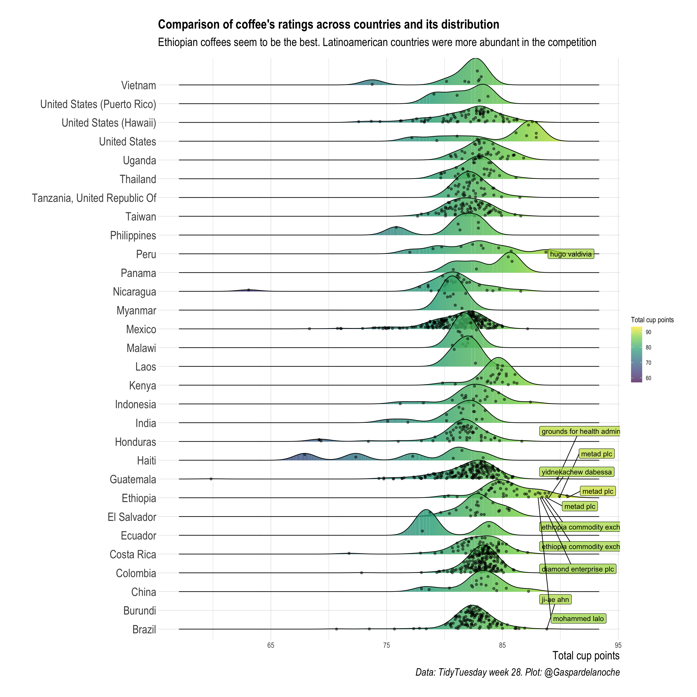

I'm exciting to share some ideas I could spot on the visualization of the [TidyTuesday](https://github.com/rfordatascience/tidytuesday) dataset about coffee ratings across different countries. Details on the code and analysis can be found on the [*TIDYTUESDAY*](https://camilogarciabotero.github.io/Tidytuesday-attempts/TT-coffee.html) tab on top of this page.

First thing one can spot is that ethiopian coffees are the best. A great proportion are over the 89 points (all the labeled are) so they not only got the best one but a set of the best coffee cups in the competition. Second insight is that Latam countries are very good in the competition and have many competiors with relatively higher scores with some exceptions. Anyway I'm currently looking forward to get some of these coffees.

